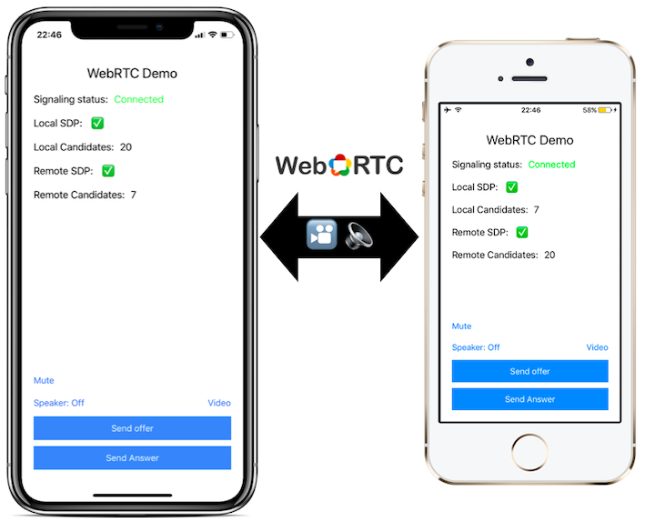

# WebRTC-iOS
A simple native WebRTC demo iOS app using swift. 

## Disclaimer
This demo app's purpose is to demonstrate the bare minimum required to establish peer to peer connection with WebRTC. **This is not a production ready code!** In order to have a production VoIP app you will need to have a real signaling server (not a simple broadcast server like in this example), deploy your own Turn server(s) and probably integrate CallKit and push notifications.
 

## Requirements
1. Xcode 12.1 or later
2. iOS 12 or later
3. Node.js + npm (For NodeJS Signaling server)  
**- OR -**  
macOS 10.15 (For Swift signaling server)

Legacy xcode support:

* [Xcode 10](https://github.com/stasel/WebRTC-iOS/tree/xcode-10) branch
* [Xcode 11](https://github.com/stasel/WebRTC-iOS/tree/xcode-11) branch

## Setup instructions
1. Start the signaling server (Either NodeJS or Swift)
2. Navigate to `WebRTC-Demo-app` folder
3. Open `WebRTC-Demo.xcworkspace`
4. Open `Config.swift` and set the `defaultSignalingServerUrl` variable to your signaling server ip/host. Don't use `localhost` or `127.0.0.1` if you plan to connect other devices in your network to your mac.
5. Build and run on devices or on a simulator (video capture is not supported on a simulator).

## Starting NodeJS signaling server
    1. Navigate to the `signaling/NodeJS` folder.
    2. Run `npm install` to install all dependencies.
    3. Run `node app.js` to start the server.

## Starting Swift signaling server
Note: This step requires MacOS 10.15

    1. Navigate to the `signaling/Swift` folder.
    2. Run `make`
    3. Run `./server` to start the server

Alternative method: Open `WebRTC-Demo.xcworkspace` and run the `SignalingServer` scheme.

## Run instructions
1. Run the app on two devices with the signaling server running.
2. Make sure both of the devices are connected to the signaling server.
3. On the first device, click on 'Send offer' - this will generate a local offer SDP and send it to the other client using the signaling server.
4. Wait until the second device receives the offer from the first device (you should see that a remote SDP has arrived).
5. Click on 'Send answer' on the second device.
6. when the answer arrives to the first device, both of the devices should be now connected to each other using webRTC, try to talk or click on the 'video' button to start capturing video.
7. To restart the process, kill both apps and repeat steps 1-6.

## CallKit integration
Disclaimer: I am not sure if this is the best way doing it but this has worked for me so far:

1. Configure WebRTC audio session to use manual audio and disable audio: 
    1. `RTCAudioSession.sharedInstance().useManualAudio = true`
    2. `RTCAudioSession.sharedInstance().isAudioEnabled = false`
2. On your `CXProvider` delegate's `provider(CXProvider, didActivate: AVAudioSession)` method:
    1. Call `RTCAudioSession.sharedInstance().audioSessionDidActivate` with the `AVAudioSession` from the `CXProvider`
    2. Enable audio: `RTCAudioSession.sharedInstance().isAudioEnabled = true` 
3. On your `CXProvider` delegate's `provider(CXProvider, didDeactivate: AVAudioSession)` call `RTCAudioSession.sharedInstance().audioSessionDidDeactivate` with the `AVAudioSession` from the `CXProvider`

WebRTC and CallKit talk from 2016: https://youtu.be/JB2MdcY1MKs?t=6m23s

## References:
* WebRTC website: https://webrtc.org/
* WebRTC source code: https://webrtc.googlesource.com/src
* WebRTC iOS compile guide: https://webrtc.github.io/webrtc-org/native-code/ios/
* appear.in dev blog post: https://github.com/appearin/tech.appear.in/blob/master/source/_posts/Getting-started-with-WebRTC-on-iOS.md (it uses old WebRTC api but still very informative)
* AppRTC: More detailed app to demonstrate WebRTC: https://webrtc.googlesource.com/src/+/refs/heads/master/examples/objc/AppRTCMobile/
* Useful information from pexip: https://pexip.github.io/pexkit-sdk/ios_media
* [Video Chat using WebRTC and Firestore](https://medium.com/@quangtqag/video-chat-using-webrtc-and-firestore-a925de6f89f4) by [Quang](https://github.com/quangtqag)

## Credits:
* App icon made by [SimpleIcon](https://www.flaticon.com/authors/simpleicon) from [www.flaticon.com](https://www.flaticon.com) is licensed by [CC 3.0 BY](http://creativecommons.org/licenses/by/3.0/)
# PerfectSelfApp
# PerfectSelfApp
# PerfectSelfApp
